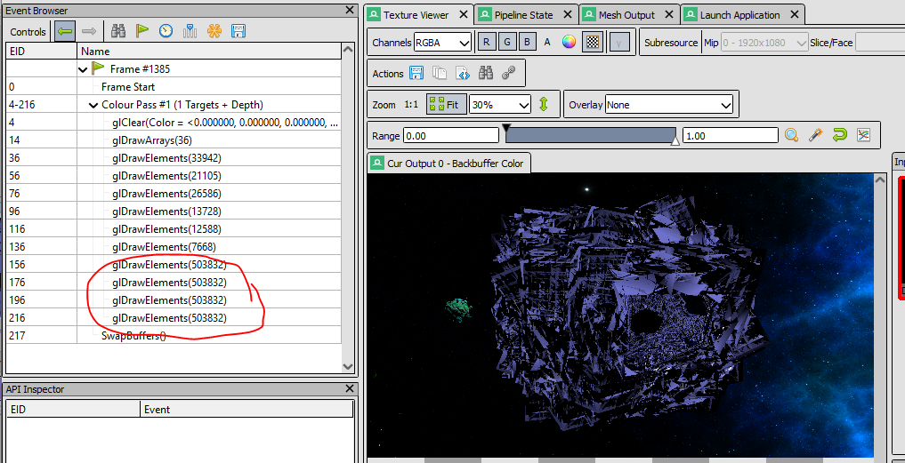

## Control Scheme
Left Click - Throw Star  
Right Click - Return Star  
W - Forward  
S - Backwards  
A - Strafe Left  
D - Strafe Right  
Left Shift - Down  
Space - Up  
Q - Lower Movement Speed
E - Increase Movement Speed
F11 - Fullscreen  

## Debugging Report

Thoughout this development I have been using a software called RenderDoc to help debug issues with graphics.

### First Issue
The first problem that the software was able to help me diagnose was one where I was getting the meshes drawn to the screen but the texture for them wasn't loading.
When looking at the mesh in RenderDoc I was able to see that the vertex positions for the mesh were going through ok, but that it wasn't outputting anything for gl_position.
Helping me to narrow down the issue and look at where some of the other data was being sent across to the shaders.

### Second Issue
The next problem that RenderDoc helped with was during the refactoring of my skybox code. I had everything working and was moving the code into its own class.
After moving everythig out of the game.cpp and into the skybox class I was finding that no skybox was being drawn.
I took a look into RenderDoc to see what part was missing.

It turned out not even the mesh was being drawn, because the glDrawArrays(36) was over on the right I knew the call to draw the cube was still going through,
but that no data was getting to the shader for the vertex positions.
For this issue I reverted the code and took a look at the input and output when it was working.

This just helped confirm that no data was passing over when using the class. I ended up going through the refactor again step by step and checking everytime
with RenderDoc to see at what point the data started to not appear in the shader.

### Future Issue
After getting a 3d mesh online to use as part of my one day particle system I was using a few of them in the scene, start up times began to increase fairly signficantly
as I added them. Opening up RenderDoc allowed for an easy insight as to possibly why.

Each of the models had over 500k elements in it, at the time I was only loading these models on startup but had future plans to use them in a particle system.
Giving that type of system would plan to use many of these models, killing and spawning more, its worth considering work arounds or just finding a different model to use.

### Not just RenderDoc!
Although RenderDoc has been an incredibly useful tool throughout this project, it hasn't been the only thing to help with debugging problems.
It's worth noting that Visual Studio itself has been wonderful for helping out. Along with the internet for discovering what the thrown errors mean.

This error pointed me in the right direction to look at Vector lists when I was trying to create the particle system. I had been trying to access something that wasn't there.
It was a small mistake of incorrect order, trying to read from an unpopulated list without error checking before the read.

# Next Iterations Plan
For the next iteration I will be looking to complete the particle generator to be used with the light. I will also aim to have this tied to being a point light and remove other lighting from the scene. Lastly being able to control the "light" in some manner.

For the particles I will be looking to have them spawn, move randomly from a point, and die. These themselves will not be the light source, they will emanate from the center point. But they will need to look like a possible light. As these will be considered to be light they will require a shader that isn't tied to the point light. 

Given the amount of elements in the current object I was planning to use, I will either, look into finding a new model (most likely) or create an array where "dead" particles are not destroyed but just not rendered and stored until a new one is born. Realistically I will probably do both as combining both options will be most efficent.

The light position that the particles will be tied too will need to be controllable in a sense by the player. I have been working on this already and will continue to aim for it being locked to the players camera, however I have back up plans of it being summonable to points in the camera lock continues to alude me.

### Additional Resources
Please see [this page](https://github.com/HoaxShark/comp220-worksheetA/tree/Worksheet-C/Effect%20Resources/Particles) for my lists of additional resources that have been used to help guide me along with implementing a particle system.
